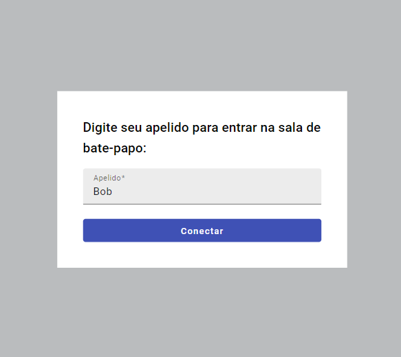

# Aplicativo de Chat em Tempo Real

Este projeto é um __aplicativo de chat em tempo real__ que permite aos usuários se comunicarem instantaneamente por meio de uma conexão com um servidor __WebSocket__. 
Desenvolvido com tecnologias modernas, o aplicativo proporciona uma experiência fluida e interativa.

## 🎯 Objetivo
O objetivo deste projeto é servir como uma ferramenta de estudo e prática na construção de uma aplicação __full-stack__ com suporte a comunicação em tempo real. 
Ao longo do desenvolvimento, foram exploradas diversas tecnologias e conceitos, promovendo um aprendizado aprofundado.

## 🔧 Tecnologias Utilizadas
- Frontend: __Angular 17.3.12__
- Backend: __Java 21__
- Comunicação em Tempo Real: __Servidor WebSocket__

## 🚀 Recursos principais:
- Navegação de página única.
- Mensagens Instantâneas: Comunicação em tempo real entre os usuários.
- Página responsiva.

## Prévia
<div style="display: flex, width: 100%">
    
    
</div>

## 🛠️ Instalação e Execução

Para rodar o aplicativo localmente, siga os passos abaixo:

### Clone este repositório:

```bash
  git clone https://github.com/oliveiravitor32/Chat_em_Tempo_Real-FullStack-WebSocket-Angular-Java.git
```

### Frontend
1. Navegue até a pasta do frontend:
   ```bash
   cd frontend
   ```
2. Instale as dependências:
   ```bash
   npm install
   ```
3. Inicie o servidor (Obs: É necessário ter o Angular CLI):
   ```bash
   ng serve
   ```
   Se você não possuir o Angular CLI instalado globalmente use:
    ```bash
   npx ng serve
    ```
    
### Backend
1. Navegue até a pasta do backend:
   ```bash
   cd backend
   ```
2. Compile e execute a aplicação:
    ```bash
   ./mvnw spring-boot:run
    ```
    
## 📖 Uso

Após iniciar o aplicativo, acesse __http://localhost:4200__ em seu navegador.

<h2 id="license">Licença 📃 </h2>

Este projeto esta sob a licença [MIT](./LICENSE)
